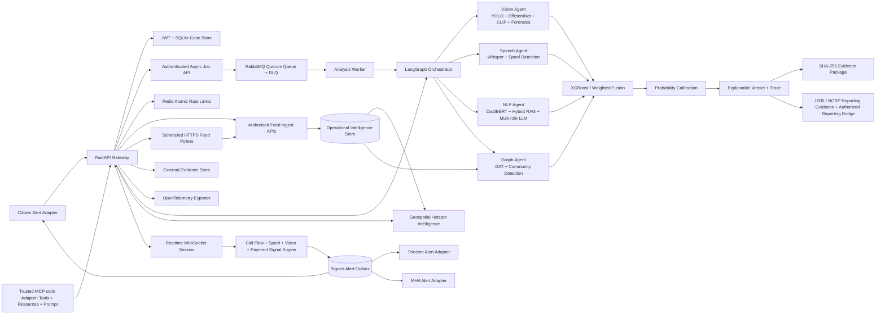

# Digital Public Safety Shield Architecture

## Deployment Boundaries

- The API is stateless for inference; authenticated profile and case history currently use SQLite for the prototype.
- Model adapters lazy-load heavyweight vision and speech models and degrade to documented fallback paths.
- RabbitMQ is optional. Queue messages contain only opaque job IDs; sensitive payloads remain in the owner-scoped job store and are erased after completion or terminal failure. Manual acknowledgement, confirms, lease heartbeats, retries, recovery, and a DLQ provide at-least-once processing with idempotent job claiming.
- Redis is optional and does not duplicate RabbitMQ. It holds only SHA-256-keyed, expiring counters for shared login and inference rate limits; no analysis payloads or results are cached.
- MCP runs as a separate stdio adapter and calls authenticated HTTP routes, preserving the API's ownership and audit boundary. It exposes annotated tools, read-only resources, and a human-reviewed triage prompt; queued tools use the same RabbitMQ job API.
- Every saved verdict receives a SHA-256 integrity record. Evidence exports add custody, model trace, fusion details, and an explicit human-review disclosure.
- Production mode is explicit: `DEPLOYMENT_MODE=production` blocks demo graph/geospatial/demo transcript endpoints unless real operational feed records are ingested or demo mode is intentionally allowed.
- Authorized feed APIs ingest geospatial incidents, graph entities/edges, normalized fraud-network events, and certified currency specimen metadata behind `SHIELD_INGEST_TOKEN`.
- Ingested data carries a mandatory trust tier: `synthetic_sandbox`, `public_research`, or `authorized`. Sandbox/public rows exercise the real pipeline but cannot satisfy strict production gates.
- Evidence can be mirrored to an external `file://` mount or encrypted S3-compatible object store. Official reporting can submit to a configured authorized bridge URL; otherwise the system creates an integrity-hashed draft for human review.
- Real-time sessions retain cumulative transcript decisions and hashed identifiers. Structured caller attestation, spoof, video-identity, payment, secrecy, and urgency signals feed a signed, retryable alert outbox.
- Twilio channel endpoints support provider signature validation; remote media is restricted to an explicit host allowlist.
- GAT inference includes a score-collapse/distribution-shift gate. Degraded graphs use evidence-derived anomaly scores and expose the fallback in `model_quality`.
- Production deployment should replace SQLite with managed PostgreSQL, use managed Redis/RabbitMQ with TLS and credential rotation, terminate TLS at an API gateway, use a secrets manager, use redacted OpenTelemetry, and ingest only authorized government, bank, and telecom feeds.

## Privacy and Safety

- Anonymous analysis is supported and is not persisted.
- Authenticated analysis is persisted only for the account that submitted it.
- Evidence packages are ownership checked and are decision-support artifacts, not autonomous enforcement decisions.
- Uploaded media is processed in memory by the API and file size/content type are restricted.
