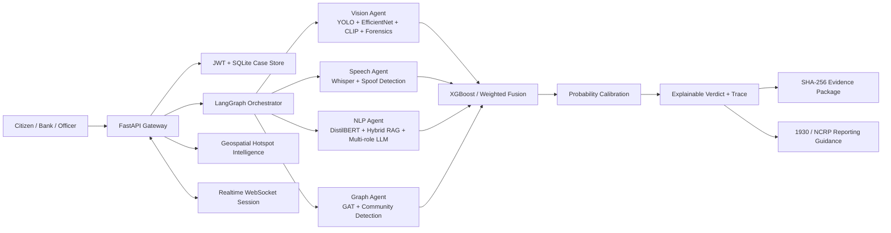

# Digital Public Safety Shield Architecture

## Deployment Boundaries

- The API is stateless for inference; authenticated profile and case history currently use SQLite for the prototype.
- Model adapters lazy-load heavyweight vision and speech models and degrade to documented fallback paths.
- Every saved verdict receives a SHA-256 integrity record. Evidence exports add custody, model trace, fusion details, and an explicit human-review disclosure.
- Production deployment should replace SQLite and the in-memory login limiter with managed PostgreSQL and Redis, terminate TLS at an API gateway, use a secrets manager, and ingest only authorized government, bank, and telecom feeds.

## Privacy and Safety

- Anonymous analysis is supported and is not persisted.
- Authenticated analysis is persisted only for the account that submitted it.
- Evidence packages are ownership checked and are decision-support artifacts, not autonomous enforcement decisions.
- Uploaded media is processed in memory by the API and file size/content type are restricted.
